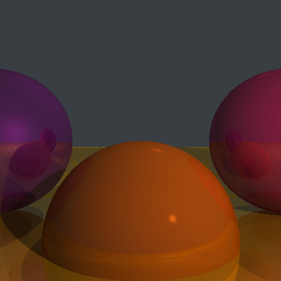

# Computer Graphics from Scratch

My implementation in C++ of Gabriel Gambetta's [Computer Graphics from Scratch](https://www.gabrielgambetta.com/computer-graphics-from-scratch/).



My version of Figure 4.8 from the text, generated by [examples/figure4-8.cpp](examples/figure4-8.cpp).


# Building the library, examples, and tests

```sh
mkdir build && cd build
cmake ..
cmake --build .
```

# Building the browser example with emscpripten

Requires that both [emscripten](https://emscripten.org/docs/getting_started/downloads.html) and [Ninja](https://ninja-build.org/) be installed.

```sh
mkdir build-emscripten && cd build-emscripten
emcmake cmake ..
cmake --build .
```

```sh
python -m http.server
# open http://localhost:8000/browser-example.html in your browser
```
