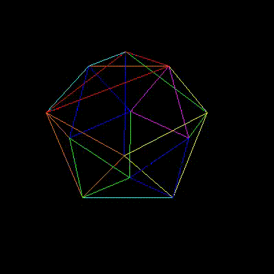

# The rotating icosahedron

```sh
# Generate the image frames
$ ./rotating_icosahedron.exe

# Use ffmpeg to convert the frames to an mp4 video
$ ffmpeg -r 5 -f image2 -s 400x400 -i rotating_icosahedron_%02d.bmp -vcodec libx264 -crf 25  -pix_fmt yuv420p rotating_icosahedron.mp4

# Convert the video to a gif
$ ffmpeg -i rotating_icosahedron.mp4 rotating_icosahedron.gif
```
